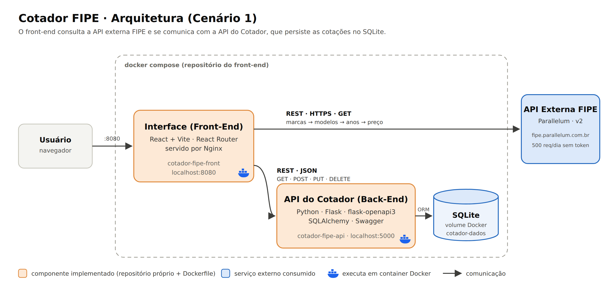

# Cotador FIPE · Front-End

Interface web de um **cotador de proteção veicular**. O usuário escolhe o veículo na **Tabela FIPE**, compara a mensalidade dos planos de proteção e registra a cotação para o cliente. Na lista de cotações é possível buscar, filtrar, alterar o status e excluir.

Este repositório é o **componente principal** do MVP da disciplina de Arquitetura de Software (Pós-graduação em Engenharia de Software, PUC-Rio).

| Componente | Repositório |
|---|---|
| Interface (este repositório) | https://github.com/acojunior/mvp-cotador-fipe-front |
| API do Cotador (back-end) | https://github.com/acojunior/mvp-cotador-fipe-api |
| API externa | API FIPE (Parallelum): https://deividfortuna.github.io/fipe/v2/ |

---

## Arquitetura



O projeto segue o **Cenário 1** do enunciado:

- A **interface** (React) consulta diretamente a **API externa FIPE** para buscar marcas, modelos, anos e o preço do veículo. Os dados são tratados no próprio front-end (o preço `"R$ 68.500,00"` vira número, o ano `32000` aparece como "Zero KM") e exibidos na tela, sem redirecionar o usuário.
- A **interface** se comunica com a **API do Cotador** via REST/JSON, usando os métodos GET, POST, PUT e DELETE. A API aplica as regras de aceitação, calcula a mensalidade e grava as cotações em **SQLite**.
- Cada componente tem seu próprio repositório e `Dockerfile`. O `docker-compose.yml` deste repositório sobe o sistema completo.

### Quando cada componente é chamado

| Tela | Ação do usuário | Componente | Chamada |
|---|---|---|---|
| Nova cotação | Escolhe o tipo de veículo | API FIPE | `GET /{tipo}/brands` |
| Nova cotação | Escolhe a marca | API FIPE | `GET /{tipo}/brands/{marca}/models` |
| Nova cotação | Escolhe o modelo | API FIPE | `GET /{tipo}/brands/{marca}/models/{modelo}/years` |
| Nova cotação | Escolhe o ano | API FIPE | `GET /{tipo}/brands/{marca}/models/{modelo}/years/{ano}` |
| Nova cotação | (automático, após o preço) | API do Cotador | `GET /planos/precos` |
| Nova cotação | Salvar cotação | API do Cotador | **`POST /cotacoes`** |
| Cotações | Abrir a tela, buscar, filtrar por status | API do Cotador | **`GET /cotacoes`** |
| Cotações | Painel de resumo (atualiza junto com a lista) | API do Cotador | `GET /dashboard/resumo` |
| Cotações | Trocar o status na tabela | API do Cotador | **`PUT /cotacoes/{id}`** |
| Cotações | Excluir | API do Cotador | **`DELETE /cotacoes/{id}`** |

---

## API externa: FIPE (Parallelum)

| Item | Informação |
|---|---|
| Serviço | API de consulta da Tabela FIPE, mantida por Deivid Fortuna (Parallelum) |
| Documentação | https://deividfortuna.github.io/fipe/v2/ |
| URL base | `https://fipe.parallelum.com.br/api/v2` |
| Custo | Gratuita |
| Licença | MIT, conforme a documentação oficial |
| Cadastro | **Não é necessário.** Sem token, o limite é de 500 requisições por dia. Com um token gratuito (cadastro em https://fipe.online), sobe para 1.000 por dia. |
| Dados | Preços médios de carros, motos e caminhões, atualizados mensalmente |

**Rotas utilizadas** (`{tipo}` = `cars`, `motorcycles` ou `trucks`):

| Rota | Uso |
|---|---|
| `GET /{tipo}/brands` | Lista de marcas |
| `GET /{tipo}/brands/{brandId}/models` | Modelos da marca |
| `GET /{tipo}/brands/{brandId}/models/{modelId}/years` | Anos e combustíveis do modelo |
| `GET /{tipo}/brands/{brandId}/models/{modelId}/years/{yearId}` | Preço, código FIPE e mês de referência |

As respostas ficam em **cache na memória** (`src/api/fipe.js`) para poupar o limite diário, e o erro de limite atingido (HTTP 429) é exibido com uma mensagem clara.

> Os **planos e preços de proteção são fictícios**, criados apenas para este MVP. Os valores dos veículos vêm da Tabela FIPE.

---

## Funcionalidades

- **Nova cotação**: seleção do veículo na FIPE, cartão com os dados do veículo, comparação dos planos lado a lado e cadastro do cliente.
- **Regras de aceitação**: veículos acima do valor máximo ou muito antigos são recusados, com o motivo na tela.
- **Painel de resumo** na tela de cotações: total, taxa de conversão, ticket médio e receita mensal das cotações fechadas.
- **Cotações**: busca por cliente, marca ou modelo, filtro por status, alteração do status direto na tabela e exclusão com confirmação.

## Tecnologias

| Tecnologia | Uso |
|---|---|
| React 19 + Vite 7 | Interface e build |
| React Router 7 | Navegação entre as duas telas |
| CSS puro | Estilos |
| Nginx | Servidor dos arquivos no container |
| Docker / Docker Compose | Execução em containers |

---

## Como executar

### Opção 1: sistema completo com Docker Compose (recomendado)

Pré-requisito: [Docker](https://docs.docker.com/get-docker/) instalado (no Windows, com WSL2 habilitado).

Clone **os dois repositórios lado a lado**, na mesma pasta:

```bash
git clone https://github.com/acojunior/mvp-cotador-fipe-front.git
git clone https://github.com/acojunior/mvp-cotador-fipe-api.git
```

```
pasta-qualquer/
├── mvp-cotador-fipe-api/
└── mvp-cotador-fipe-front/   ← o docker-compose.yml fica aqui
```

Suba tudo a partir deste repositório:

```bash
cd mvp-cotador-fipe-front
docker compose up --build
```

| Serviço | Endereço |
|---|---|
| Interface | http://localhost:8080 |
| API do Cotador | http://localhost:5000 |
| Swagger da API | http://localhost:5000/openapi/swagger |

Para parar: `docker compose down` (os dados ficam no volume `cotador-dados`; para apagá-los, `docker compose down -v`).

### Opção 2: apenas o container do front-end

Com a API já rodando em `http://localhost:5000`:

```bash
docker build -t cotador-fipe-front .
docker run -d --name cotador-fipe-front -p 8080:80 cotador-fipe-front
```

### Opção 3: ambiente de desenvolvimento

Pré-requisito: [Node.js](https://nodejs.org/) 20.19+ ou 22+.

```bash
npm install
npm run dev
```

Acesse http://localhost:5173. O endereço da API pode ser alterado copiando `.env.example` para `.env`.

---

## Estrutura de pastas

```
mvp-cotador-fipe-front/
├── docs/arquitetura.png       # fluxograma da arquitetura
├── src/
│   ├── api/
│   │   ├── http.js            # fetch compartilhado e tratamento de erros
│   │   ├── fipe.js            # cliente da API externa FIPE
│   │   └── cotador.js         # cliente da API do Cotador (GET/POST/PUT/DELETE)
│   ├── components/
│   │   ├── Layout.jsx
│   │   ├── ResumoCotacoes.jsx # painel com os números gerais
│   │   ├── VeiculoCard.jsx
│   │   └── PlanoCard.jsx
│   ├── pages/
│   │   ├── NovaCotacao.jsx
│   │   └── Cotacoes.jsx
│   ├── styles/global.css
│   ├── utils/                 # formatação e constantes
│   ├── App.jsx                # rotas
│   └── main.jsx
├── Dockerfile                 # build (Node) + servidor (Nginx)
├── docker-compose.yml         # sobe front-end + API
├── nginx.conf
└── package.json
```

## Autor

Antonio Carlos · MVP da disciplina de Arquitetura de Software, Pós-graduação em Engenharia de Software da PUC-Rio (2026).
